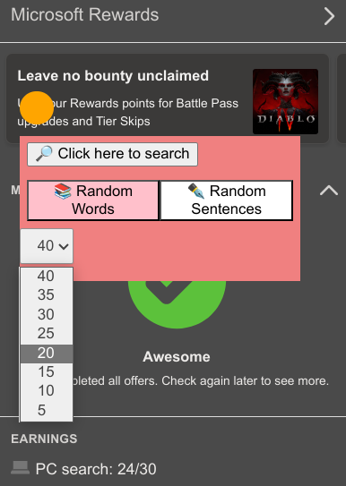

# AutoMS Rewards

This is a userscript that automatically earns daily Microsoft Rewards points by searching for random words on Bing.

## Features

- Adds a circular icon on the Bing page, which automatically searches for each of the 40 random words (Either enable predefined words or random words from the English dictionary) when clicked.
- Closes all search pages automatically after 15 seconds.
- A checkbox toggle switch to search random words from English dictionary.

> Note: Untick the checkbox if you want to search predefined random words from the script.

## Installation

To use this script, you need to install a userscript manager extension for your browser, such as [Tampermonkey](https://www.tampermonkey.net/) or [Greasemonkey](https://www.greasespot.net/).

Then, you can install the script from [this link](https://github.com/saitamasahil/AutoMS-Rewards/raw/main/code.js) & copy paste the code into the extension.

## Usage

To use the script, simply visit the Bing website and click on the pink circular icon in Microsoft rewards section. The script will then open 40 tabs and search for predefined random words on each tab. After 15 seconds, all tabs will be closed automatically. Tick the checkbox to search random words from English dictionary.

You can use this script once per day to earn Microsoft Rewards points.

> Note: Please ensure that your browser's settings allow pop-ups, otherwise this script may not function properly.

## Screenshot

    

## Disclaimer

This script is for educational purposes only and is not affiliated with or endorsed by Microsoft or Bing. Use it at your own risk and responsibility. The author is not liable for any consequences that may arise from using this script.